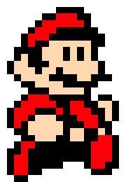

Mario_pixel
================

Thanks to [`pixeltrix`](https://github.com/matt-dray/pixeltrix) package,
it is much easier to create pixel art images in R.

``` r
# install.packages("remotes")  # if not yet installed
# remotes::install_github("matt-dray/pixeltrix")
library(pixeltrix)
```

Here, we draw pixel frames of [Mario from Super Mario
Bros. 3](https://www.mariouniverse.com/wp-content/img/sprites/nes/smb3/mario-2.gif).

## Define colors

Define color palettes.

``` r
mario_cols <- c("white","black","red",
                rgb(red = 255, green = 224, blue = 189, maxColorValue = 255))
```

## Create color matrix for frames

``` r
jump =
  matrix(c(0,0,0,0,0,0,0,0,0,0,0,0,0,0,0,0,0,0,
           0,0,0,0,0,0,0,0,1,1,1,1,0,1,1,1,0,0,
           0,0,0,0,0,0,1,1,2,2,2,1,1,3,3,3,1,0,
           0,0,0,0,0,1,2,2,2,2,2,2,1,3,3,3,1,0,
           0,0,0,0,1,2,2,2,1,1,1,1,1,1,3,3,1,0,
           0,0,0,1,2,2,2,1,1,1,1,1,1,1,1,3,1,0,
           0,0,0,1,2,1,1,3,3,3,3,3,3,1,1,1,0,0,
           0,0,1,1,1,1,3,3,3,1,3,1,3,1,2,2,1,0,
           0,0,1,3,1,1,3,3,3,1,3,1,3,1,2,2,1,0,
           0,1,3,3,1,1,1,3,3,3,3,3,3,3,1,2,1,0,
           0,1,3,3,3,1,3,3,1,3,3,3,3,3,1,2,1,0,
           0,0,1,3,3,3,3,1,1,1,1,3,3,1,1,1,0,0,
           0,0,0,1,1,3,3,3,3,1,1,1,1,1,2,1,0,0,
           0,0,0,0,1,1,1,3,3,3,3,3,1,2,2,1,0,0,
           0,0,0,1,2,2,2,1,1,1,1,1,1,2,1,0,0,0,
           0,0,1,2,2,2,2,2,1,1,2,2,1,1,0,0,0,0,
           0,1,2,2,2,1,1,1,2,1,2,2,2,1,1,0,0,0,
           0,1,2,2,1,3,3,3,1,1,1,2,2,2,1,0,0,0,
           0,1,2,1,3,3,3,3,3,1,1,1,2,2,1,1,0,0,
           0,0,1,1,3,3,3,3,3,1,3,3,1,1,3,1,0,0,
           0,0,0,1,1,3,3,3,1,1,3,3,1,1,2,2,1,0,
           0,0,1,2,2,1,1,1,1,1,1,1,1,2,2,2,1,0,
           0,1,1,2,1,1,1,1,1,1,1,1,1,2,2,2,1,0,
           0,1,2,2,1,1,1,1,1,1,1,1,1,2,2,2,1,0,
           0,1,2,2,1,1,1,1,1,0,0,0,1,2,2,1,1,0,
           0,1,2,2,1,1,0,0,0,0,0,0,0,1,1,1,0,0,
           0,0,1,1,0,0,0,0,0,0,0,0,0,0,0,0,0,0), ncol=18, byrow=TRUE)
walk1 = matrix(c(0,0,0,0,0,0,0,0,0,0,0,0,0,0,0,0,0,0,
                 0,0,0,0,0,0,0,0,1,1,1,1,0,0,0,0,0,0,
                 0,0,0,0,0,0,1,1,2,2,2,1,1,0,0,0,0,0,
                 0,0,0,0,0,1,2,2,2,2,2,2,1,0,0,0,0,0,
                 0,0,0,0,1,2,2,2,1,1,1,1,1,1,0,0,0,0,
                 0,0,0,1,2,2,2,1,1,1,1,1,1,1,1,0,0,0,
                 0,0,0,1,2,1,1,3,3,3,3,3,3,1,1,0,0,0,
                 0,0,1,1,1,1,3,3,3,1,3,1,3,1,0,0,0,0,
                 0,0,1,3,1,1,3,3,3,1,3,1,3,1,0,0,0,0,
                 0,1,3,3,1,1,1,3,3,3,3,3,3,3,1,0,0,0,
                 0,1,3,3,3,1,3,3,1,3,3,3,3,3,1,0,0,0,
                 0,0,1,3,3,3,3,1,1,1,1,3,3,1,1,1,0,0,
                 0,0,0,1,1,3,3,3,3,1,1,1,1,1,0,0,0,0,
                 0,0,0,0,1,1,1,3,3,3,3,3,1,0,0,0,0,0,
                 0,0,0,1,2,2,2,1,1,1,1,1,1,0,1,1,0,0,
                 0,0,1,2,2,2,2,2,1,1,2,2,1,1,3,3,1,0,
                 0,1,2,2,2,1,1,1,2,1,2,2,2,1,1,3,1,0,
                 0,1,2,2,1,3,3,3,1,1,1,2,2,2,1,3,1,0,
                 0,1,2,1,3,3,3,3,3,1,1,1,2,2,1,1,0,0,
                 0,0,1,1,3,3,3,3,3,1,3,3,1,1,3,1,0,0,
                 0,0,0,1,1,3,3,3,1,1,3,3,1,1,2,2,1,0,
                 0,0,1,2,2,1,1,1,1,1,1,1,1,2,2,2,1,0,
                 0,1,1,2,1,1,1,1,1,1,1,1,1,2,2,2,1,0,
                 0,1,2,2,1,1,1,1,1,1,1,1,1,2,2,2,1,0,
                 0,1,2,2,1,1,1,1,1,0,0,0,1,2,2,1,1,0,
                 0,1,2,2,1,1,0,0,0,0,0,0,0,1,1,1,0,0,
                 0,0,1,1,0,0,0,0,0,0,0,0,0,0,0,0,0,0), ncol=18, byrow=TRUE)
walk2 = matrix(c(0,0,0,0,0,0,0,1,1,1,1,0,0,0,0,0,0,0,
                 0,0,0,0,0,1,1,2,2,2,2,1,0,0,0,0,0,0,
                 0,0,0,0,1,2,2,2,2,2,2,1,0,0,0,0,0,0,
                 0,0,0,1,2,2,2,2,1,1,1,1,1,1,0,0,0,0,
                 0,0,1,2,2,2,1,1,1,1,1,1,1,1,1,0,0,0,
                 0,0,1,2,2,1,1,3,3,3,3,3,1,1,0,0,0,0,
                 0,1,1,1,1,1,3,3,3,1,3,1,1,0,0,0,0,0,
                 0,1,3,3,1,1,3,3,3,1,3,1,1,1,0,0,0,0,
                 0,1,3,3,1,1,1,3,3,3,3,3,3,3,1,0,0,0,
                 0,1,3,3,3,1,3,3,1,3,3,3,3,3,1,0,0,0,
                 0,0,1,3,3,3,3,1,1,1,1,3,3,1,1,1,0,0,  
                 0,0,0,1,1,3,3,3,3,1,1,1,1,1,0,0,1,0,
                 0,0,1,1,1,1,3,3,3,3,3,1,0,0,1,1,0,0,
                 0,1,2,2,2,1,1,1,1,1,1,0,0,1,0,0,0,0,
                 0,1,2,2,2,1,1,1,2,2,1,1,1,1,0,0,0,0,
                 1,2,2,2,1,3,3,3,1,2,2,1,1,3,1,0,0,0,
                 1,2,2,1,3,3,3,3,3,1,2,2,1,3,1,0,0,0,
                 1,2,2,1,3,3,3,3,3,1,2,2,1,1,0,0,0,0,
                 1,1,2,2,1,3,3,3,1,3,1,1,3,1,0,0,0,0,
                 0,1,1,1,1,1,1,1,3,3,1,1,3,1,0,0,0,0,
                 0,1,1,1,1,1,1,1,1,1,1,1,1,1,0,0,0,0,
                 0,0,1,1,1,1,1,1,1,1,1,1,1,1,1,0,0,0,
                 0,1,2,1,1,1,1,1,1,1,1,1,1,2,2,1,0,0,
                 0,1,2,1,1,1,1,1,1,1,1,1,2,2,2,1,0,0,
                 0,1,2,2,1,1,1,0,0,0,1,2,2,2,1,0,0,0,
                 0,0,1,2,2,2,2,1,0,0,1,2,2,1,0,0,0,0,
                 0,0,0,1,1,1,1,1,0,0,1,1,1,0,0,0,0,0), ncol=18, byrow=TRUE)
```

## Create pixel frame lists

``` r
raise_hand <- list(walk1, jump)
walk <- list(walk1, walk2)
```

## Save to gif

``` r
gif_pixels(raise_hand, mario_cols, "figures/raise_hand.gif", 
           width=180, height= 260, delay = 0.25)
gif_pixels(walk, mario_cols, "figures/walk.gif", 
           width=180, height= 260, delay = 0.25)
```

Here are the generated gif files:

 

## SessionInfo

``` r
sessionInfo()
```

    ## R version 4.2.2 (2022-10-31)
    ## Platform: aarch64-apple-darwin20 (64-bit)
    ## Running under: macOS Ventura 13.1
    ## 
    ## Matrix products: default
    ## LAPACK: /Library/Frameworks/R.framework/Versions/4.2-arm64/Resources/lib/libRlapack.dylib
    ## 
    ## locale:
    ## [1] en_US.UTF-8/en_US.UTF-8/en_US.UTF-8/C/en_US.UTF-8/en_US.UTF-8
    ## 
    ## attached base packages:
    ## [1] stats     graphics  grDevices utils     datasets  methods   base     
    ## 
    ## other attached packages:
    ## [1] pixeltrix_0.1.3
    ## 
    ## loaded via a namespace (and not attached):
    ##  [1] digest_0.6.31   lifecycle_1.0.3 magrittr_2.0.3  evaluate_0.19  
    ##  [5] rlang_1.0.6     stringi_1.7.8   cli_3.4.1       gifski_1.6.6-1 
    ##  [9] rstudioapi_0.14 vctrs_0.5.1     rmarkdown_2.19  tools_4.2.2    
    ## [13] stringr_1.5.0   glue_1.6.2      xfun_0.35       yaml_2.3.6     
    ## [17] fastmap_1.1.0   compiler_4.2.2  htmltools_0.5.4 knitr_1.41
