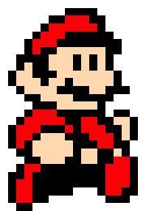

```{r setup, include=FALSE}
knitr::opts_chunk$set(echo = TRUE)
knitr::opts_chunk$set(class.source = "foldable")
```

Thanks to [`pixeltrix`](https://github.com/matt-dray/pixeltrix) package, it is much easier to create pixel art images in R.


```{r package}
# install.packages("remotes")  # if not yet installed
# remotes::install_github("matt-dray/pixeltrix")
library(pixeltrix)
```

## Define colors

Define color palettes. 

```{r}
mario_cols <- c("white","black","red",
                rgb(red = 255, green = 224, blue = 189, maxColorValue = 255))
```

## Create color matrix for frames

```{r colormat, class.source = 'fold-hide'}
jump =
  matrix(c(0,0,0,0,0,0,0,0,0,0,0,0,0,0,0,0,0,0,
           0,0,0,0,0,0,0,0,1,1,1,1,0,1,1,1,0,0,
           0,0,0,0,0,0,1,1,2,2,2,1,1,3,3,3,1,0,
           0,0,0,0,0,1,2,2,2,2,2,2,1,3,3,3,1,0,
           0,0,0,0,1,2,2,2,1,1,1,1,1,1,3,3,1,0,
           0,0,0,1,2,2,2,1,1,1,1,1,1,1,1,3,1,0,
           0,0,0,1,2,1,1,3,3,3,3,3,3,1,1,1,0,0,
           0,0,1,1,1,1,3,3,3,1,3,1,3,1,2,2,1,0,
           0,0,1,3,1,1,3,3,3,1,3,1,3,1,2,2,1,0,
           0,1,3,3,1,1,1,3,3,3,3,3,3,3,1,2,1,0,
           0,1,3,3,3,1,3,3,1,3,3,3,3,3,1,2,1,0,
           0,0,1,3,3,3,3,1,1,1,1,3,3,1,1,1,0,0,
           0,0,0,1,1,3,3,3,3,1,1,1,1,1,2,1,0,0,
           0,0,0,0,1,1,1,3,3,3,3,3,1,2,2,1,0,0,
           0,0,0,1,2,2,2,1,1,1,1,1,1,2,1,0,0,0,
           0,0,1,2,2,2,2,2,1,1,2,2,1,1,0,0,0,0,
           0,1,2,2,2,1,1,1,2,1,2,2,2,1,1,0,0,0,
           0,1,2,2,1,3,3,3,1,1,1,2,2,2,1,0,0,0,
           0,1,2,1,3,3,3,3,3,1,1,1,2,2,1,1,0,0,
           0,0,1,1,3,3,3,3,3,1,3,3,1,1,3,1,0,0,
           0,0,0,1,1,3,3,3,1,1,3,3,1,1,2,2,1,0,
           0,0,1,2,2,1,1,1,1,1,1,1,1,2,2,2,1,0,
           0,1,1,2,1,1,1,1,1,1,1,1,1,2,2,2,1,0,
           0,1,2,2,1,1,1,1,1,1,1,1,1,2,2,2,1,0,
           0,1,2,2,1,1,1,1,1,0,0,0,1,2,2,1,1,0,
           0,1,2,2,1,1,0,0,0,0,0,0,0,1,1,1,0,0,
           0,0,1,1,0,0,0,0,0,0,0,0,0,0,0,0,0,0), ncol=18, byrow=TRUE)
walk1 = matrix(c(0,0,0,0,0,0,0,0,0,0,0,0,0,0,0,0,0,0,
                 0,0,0,0,0,0,0,0,1,1,1,1,0,0,0,0,0,0,
                 0,0,0,0,0,0,1,1,2,2,2,1,1,0,0,0,0,0,
                 0,0,0,0,0,1,2,2,2,2,2,2,1,0,0,0,0,0,
                 0,0,0,0,1,2,2,2,1,1,1,1,1,1,0,0,0,0,
                 0,0,0,1,2,2,2,1,1,1,1,1,1,1,1,0,0,0,
                 0,0,0,1,2,1,1,3,3,3,3,3,3,1,1,0,0,0,
                 0,0,1,1,1,1,3,3,3,1,3,1,3,1,0,0,0,0,
                 0,0,1,3,1,1,3,3,3,1,3,1,3,1,0,0,0,0,
                 0,1,3,3,1,1,1,3,3,3,3,3,3,3,1,0,0,0,
                 0,1,3,3,3,1,3,3,1,3,3,3,3,3,1,0,0,0,
                 0,0,1,3,3,3,3,1,1,1,1,3,3,1,1,1,0,0,
                 0,0,0,1,1,3,3,3,3,1,1,1,1,1,0,0,0,0,
                 0,0,0,0,1,1,1,3,3,3,3,3,1,0,0,0,0,0,
                 0,0,0,1,2,2,2,1,1,1,1,1,1,0,1,1,0,0,
                 0,0,1,2,2,2,2,2,1,1,2,2,1,1,3,3,1,0,
                 0,1,2,2,2,1,1,1,2,1,2,2,2,1,1,3,1,0,
                 0,1,2,2,1,3,3,3,1,1,1,2,2,2,1,3,1,0,
                 0,1,2,1,3,3,3,3,3,1,1,1,2,2,1,1,0,0,
                 0,0,1,1,3,3,3,3,3,1,3,3,1,1,3,1,0,0,
                 0,0,0,1,1,3,3,3,1,1,3,3,1,1,2,2,1,0,
                 0,0,1,2,2,1,1,1,1,1,1,1,1,2,2,2,1,0,
                 0,1,1,2,1,1,1,1,1,1,1,1,1,2,2,2,1,0,
                 0,1,2,2,1,1,1,1,1,1,1,1,1,2,2,2,1,0,
                 0,1,2,2,1,1,1,1,1,0,0,0,1,2,2,1,1,0,
                 0,1,2,2,1,1,0,0,0,0,0,0,0,1,1,1,0,0,
                 0,0,1,1,0,0,0,0,0,0,0,0,0,0,0,0,0,0), ncol=18, byrow=TRUE)
walk2 = matrix(c(0,0,0,0,0,0,0,1,1,1,1,0,0,0,0,0,0,0,
                 0,0,0,0,0,1,1,2,2,2,2,1,0,0,0,0,0,0,
                 0,0,0,0,1,2,2,2,2,2,2,1,0,0,0,0,0,0,
                 0,0,0,1,2,2,2,2,1,1,1,1,1,1,0,0,0,0,
                 0,0,1,2,2,2,1,1,1,1,1,1,1,1,1,0,0,0,
                 0,0,1,2,2,1,1,3,3,3,3,3,1,1,0,0,0,0,
                 0,1,1,1,1,1,3,3,3,1,3,1,1,0,0,0,0,0,
                 0,1,3,3,1,1,3,3,3,1,3,1,1,1,0,0,0,0,
                 0,1,3,3,1,1,1,3,3,3,3,3,3,3,1,0,0,0,
                 0,1,3,3,3,1,3,3,1,3,3,3,3,3,1,0,0,0,
                 0,0,1,3,3,3,3,1,1,1,1,3,3,1,1,1,0,0,  
                 0,0,0,1,1,3,3,3,3,1,1,1,1,1,0,0,1,0,
                 0,0,1,1,1,1,3,3,3,3,3,1,0,0,1,1,0,0,
                 0,1,2,2,2,1,1,1,1,1,1,0,0,1,0,0,0,0,
                 0,1,2,2,2,1,1,1,2,2,1,1,1,1,0,0,0,0,
                 1,2,2,2,1,3,3,3,1,2,2,1,1,3,1,0,0,0,
                 1,2,2,1,3,3,3,3,3,1,2,2,1,3,1,0,0,0,
                 1,2,2,1,3,3,3,3,3,1,2,2,1,1,0,0,0,0,
                 1,1,2,2,1,3,3,3,1,3,1,1,3,1,0,0,0,0,
                 0,1,1,1,1,1,1,1,3,3,1,1,3,1,0,0,0,0,
                 0,1,1,1,1,1,1,1,1,1,1,1,1,1,0,0,0,0,
                 0,0,1,1,1,1,1,1,1,1,1,1,1,1,1,0,0,0,
                 0,1,2,1,1,1,1,1,1,1,1,1,1,2,2,1,0,0,
                 0,1,2,1,1,1,1,1,1,1,1,1,2,2,2,1,0,0,
                 0,1,2,2,1,1,1,0,0,0,1,2,2,2,1,0,0,0,
                 0,0,1,2,2,2,2,1,0,0,1,2,2,1,0,0,0,0,
                 0,0,0,1,1,1,1,1,0,0,1,1,1,0,0,0,0,0), ncol=18, byrow=TRUE)
```

## Create pixel frame lists

```{r}
raise_hand <- list(walk1, jump)
walk <- list(walk1, walk2)
```


## Save to gif


```{r results='hide'}
gif_pixels(raise_hand, mario_cols, "figures/raise_hand.gif", 
           width=180, height= 260, delay = 0.25)
gif_pixels(walk, mario_cols, "figures/walk.gif", 
           width=180, height= 260, delay = 0.25)
```


Here are the generated gif files:




## SessionInfo

```{r}
sessionInfo()
```

